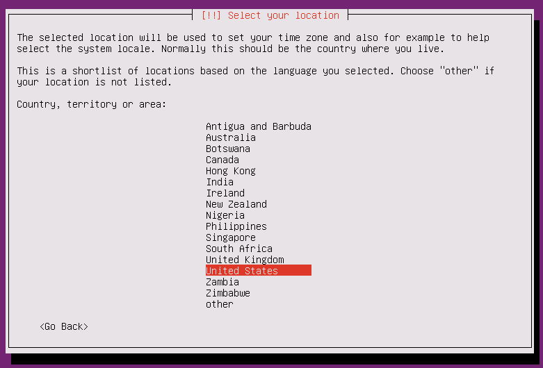
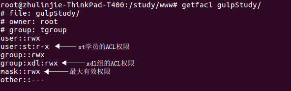
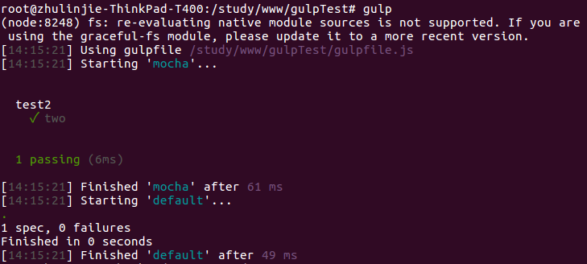

#Ubuntu快速入门

>ubuntu官网：[http://www.ubuntu.com](http://www.ubuntu.com)  
>ubuntu中文官网：[http://cn.ubuntu.com/](http://cn.ubuntu.com/)

###Ubuntu 14.04 LTS 服务器版安装

选择ubuntu版本，这里选择英文版  


选择第一项，开始安装  


选择语言  


选择区域  


是否要检测键盘布局  


选择英文键盘布局  


配置主机名  


管理员账号  


设置密码  


确认密码  


是否要把我们的家目录进行加密  


配置时区  


选择磁盘模式，这里选择第一项  


对磁盘进行分区格式化  


配置代理服务器，这里留空  


选择第二项，安装一些必要的安全更新  


选择要安装的软件，这里只选择第一项  


是否要加载boot loader  


###Linux常用命令
`ls -l` 详细信息显示  
`ls -d` 查看目录属性  
`ls -h` 以K、M、G为单位查看文件的大小  
`ls -i` 显示文件索引节点号（inode）。一个索引节点代表一个文件  
`ls -m` 水平输出文件列表  
`ls -ltr` 按修改时间列出文件和文件夹详细信息（升序）   
`ls -lt` 按修改时间列出文件和文件夹详细信息（降序）  
`du -sh` 查看文件或目录的大小  
`mkdir -m` 建立目录的同时设置目录的权限  
`mkdir -p` 递归创建目录  
`rmdir` 删除空目录  
`cp` 复制文件  
`cp -r` 递归处理，复制指定目录下的所有文件与子目录  
`cp -p` 保留源文件或目录的属性，比如：最后修改时间  
`rm` 删除文件  
`rm -r` 递归处理，删除指定目录下的所有文件与子目录  
`rm -f` 强制删除文件或目录  
`touch` 一是用于把已经存在的文件的最后一次修改时间更新为系统当前时间，它们的数据会原封不动的保留下来；二是用来创建一个空文件  
`cat -n` 显示文件内容，由1开始对所有输出的行数编号  

`more` 显示文件内容  
```
f 显示下一屏 
b 显示上一屏
enter 显示下一行
h 显示帮助屏
```

less 显示文件内容
```
e 下一行
y 上一行
f 下一屏
b 上一屏
d 下半屏
u 上半屏
/匹配内容+n 向下搜索匹配内容
?匹配内容+n 向上搜索匹配内容
h 显示帮助屏
```

`head` 显示文件前10行  
`head -n 20` 显示文件前20行  
`head -c 10` 显示文件前10个字节的内容  
`head -v` 显示文件前10行并显示文件头信息  
`tail -f` 显示文件最新追加的内容，用于监视文件的变化  
`ln -s` 创建软链接  
`ln` 创建硬链接  

####硬链接特征
``` 
相当于cp -p + 同步更新
硬链接的i节点与源文件相同
不能跨分区创建硬链接
不能对目录创建硬链接
```

`tree` 树状显示目录结构  
`tree -i` 不以阶梯状列出文件和目录名称  
`tree -s` 列出文件和目录大小  
`tree -p` 列出权限标示  
`tree -D` 列出文件或目录的更改时间  

`chmod [{ugoa}{+-=}{rwx}]` 变更文件或目录的权限  
`chmod -R` 递归设置指定目录下的所有文件及子目录的权限  
```
mkdir -p a/b/c/d/e
chmod -R 555 a
tree -ispD a
chmod -R u+w,g=rwx,o+w a
tree -ispD a
```
####文件目录权限总结  


`chown root index.php` chown命令功能是更改文件或目录的所有者，这里是将index.php的所有者更改为root用户  

`chgrp xdl index.php` chgrp命令功能是更改文件或目录的所属组，这里是将index.php的所属组更改为xdl  

>只有root用户和文件所有者可以更改一个文件的权限，只有root用户可以更改文件的所有者和所属组  

`umask` 用来显示/设置限制新建文件权限的掩码  
`umask -S` 以rwx形式显示新建文件缺省权限  
>需要注意的是新建的文件因为默认是没有可执行权限的，因此要在缺省权限的基础上再减去可执行权限  

`rar x` 解压缩.rar文件  
`tar -zxvf` 解压缩.tar.gz文件  
`tar -jxvf filename.tar.bz2 -C` 欲解压缩的目录 解压缩.tar.bz2文件  
`unzip react-15.3.0.zip` 在当前目录下解压缩  
`unzip -n react-15.3.0.zip -d /tmp` 将压缩文件react-15.3.0.zip在指定目录/tmp下解压缩，如果已有相同的文件存在，要求unzip命令不覆盖原先的文件  
`unzip -o react-15.3.0.zip -d /tmp` 将压缩文件react-15.3.0.zip在指定目录/tmp下解压缩，如果已有相同的文件存在，要求unzip命令覆盖原先的文件  
`zip -r laravel.zip laravel/`  将laravel目录压缩成laravel.zip  

`useradd zhangsan` 添加新用户  
`passwd zhangsan` 设置用户密码    
`passwd` 更改自己的密码  
>root用户可以用`passwd 用户名`这条命令来设置所有用户的密码，而每个普通用户则只能更改自己的密码  

who 显示目前登录系统的用户信息  
  

`uptime` 能够打印系统总共运行了多长时间和系统的平均负载。uptime命令可以显示的信息显示依次为：现在时间、系统已经运行了多长时间、目前有多少登陆用户、系统在过去的1分钟、5分钟和15分钟内的平均负载  

>[root@LinServ-1 ~]# uptime  
>15:31:30 up 127 days, 3:00, 1 user, load average: 0.00, 0.00, 0.00  

显示内容说明：  
```
15:31:30				//系统当前时间
up 127 days,  3:00 		//主机已运行时间,时间越大，说明你的机器越稳定。 
1 user 					//用户连接数，是总连接数而不是用户数 
load average: 0.00, 0.00, 0.00 	//系统平均负载，统计最近1，5，15分钟的系统平均负载
```

w 显示目录登录系统的用户的详细信息
```
FROM			//登录IP，如果是本地终端登录，这一项则为空或为 :0
LOGIN@			//什么时间登录的
IDLE			//当前登录的用户已经空闲了多长时间	
JCPU			//当前登录的用户已经累计占用了多少CPU时间
PCPU			//当前执行的命令占用了多少CPU时间
WHAT			//当前登录的用户正在执行什么命令
```

Linux系统负载监控-load average  
>http://www.linuxidc.com/Linux/2015-01/111826.htm  
>http://www.cnblogs.com/kaituorensheng/p/3602805.html  

`df` 用于显示磁盘分区上的可使用的磁盘空间。默认显示单位为KB。可以利用该命令来获取硬盘被占用了多少空间，目前还剩下多少空间等信息  
`df -h` 以KB以上的单位来显示，即以可读性较高的方式来显示信息  

`dumpe2fs -h /dev/sda7` 用于查询指定分区详细的文件系统信息，这里用来查看是否支持ACL权限，只要默认挂载选项中包含acl，则说明是支持ACL权限的  
```
Default mount options:    user_xattr acl
```

临时开启分区ACL权限
```
mount -o remount,acl /    //重新挂载根分区，并挂载加入acl权限
```

    


####ACL小实例
  
```
cd /study/www
mkdir gulpStudy
useradd zhangsan
passwd zhangsan
useradd lishi
passwd lishi
groupadd tgroup
gpasswd -a zhangsan tgroup
gpasswd -a lishi tgroup
cat /etc/group
chown root:tgroup gulpStudy/
chmod 770 gulpStudy/
useradd st							//st学员
passwd st
setfacl -m u:st:rx gulpStudy/
getfacl gulpStudy
su st
cd /study/www/gulpStudy
touch test.txt						//会提示无法创建，权限不够
su root
cd /study/www
groupadd xdl
setfacl -m g:xdl:rwx gulpStudy/		//为xdl组分配ACL权限
```

`getfacl gulpStudy/`		运行结果如下图：  
  

  

`setfacl -m m:rx gulpStudy/` 修改最大有效权限  
`getfacl gulpStudy/` 运行结果如下图：  
  
>最大有效权限会影响文件或目录的ACL权限和所属组的权限  

`setfacl -m u:st:rw gulpStudy/` 重新为st学员分配acl权限  
`getfacl gulpStudy/` 运行结果如下图：  
  
>ACL权限也会影响最大有效权限  

  
  

  

  

####权限的继承
`setfacl -b gulpStudy/` 接上面的操作，先删除gulpStudy所有的acl权限  
  
  
  

>当对一个目录设置了默认ACL权限，则以后在它里面新建的文件和目录则会继承该目录的权限  

`setfacl -k gulpStudy/` 删除gulpStudy目录默认ACL权限  

####进程管理
  

  

`ps aux` 查看系统中所有进程，使用UNIX操作系统格式  
  
```
USER			//该进程是由哪个用户产生的
PID				//进程的ID号
%CPU			//该进程占用CPU资源的百分比，占用越高，进程越耗费资源
%MEM			//该进程占用物理内存的百分比，占用越高，进程越耗费资源
VSZ				//该进程占用虚拟内存的大小，单位KB
RSS				//该进程占用实际物理内存的大小，单位KB
TTY				//该进程是在哪个终端中运行的。其中tty1-tty7代表本地控制台终端，tt1-tty6是本地的字符界面终端，tty7是图形终端，按Ctrl+Alt 加 F1-F6可以切换到对应的字符终端，按Ctrl+Alt+F7或者Alt+F7切换到图形终端。pst/0-255代表虚拟终端，也可以认为是远程登录终端。？号表示该进程不是由终端调用的，而是由内核直接产生的，因此它不知道是由哪个终端来的，所以是问号。
STAT			//进程状态。常见的状态有：R运行 S睡眠 T停止状态 s包含子进程 +位于后台
START			//该进程的启动时间
TIME			//该进程占用CPU的运算时间，注意不是系统时间，数值越大表示越耗资源
COMMAND			//产生此进程的命令名
```

`ps -le` 查看系统中所有进程，使用Linux标准命令格式  

  

  

  
>僵尸进程或者叫将死进程，它是指这个进程正在终止，但是还没有终止完全  

  

通俗的解释  
```
Cpu(s): 0.1%us		CPU被用户占了多少
0.1%sy				CPU被系统占了多少
0.0%ni				CPU被改变过优先级的进程占了多少
99.7%id				CPU的空闲率
0.1%wa				等待输入/输出的进程占用的百分比
0.0%hi				硬中断请求占用的百分比
0.1%si				软中断请求占用的百分比
0.0%st				虚拟时间百分比
```

  

  

  

`kill -l` 查看可用的进程信号，常用信号有如下几个：  
```
1 	SIGHUP		该信号让进程立即关闭，然后重新读取配置文件之后重启
9	SIGKILL		用来立即结束程序的运行。本信号不能被阻塞、处理和忽略。一般用于强制终止进程
15	SIGTERM		正常结束进程的信号，kill命令的默认信号。有时如果进程已经发生问题，这个信号是无法正常终止的，我们才会尝试SIGKILL信号，也就是信号9
```

`kill -1 22354` 重启进程  
`kill -9 22368` 强制杀死进程  

`killall [选项][信号] 进程名` 按照进程名杀死进程
```
选项：
-i		交互式，询问是否要杀死某个进程
-I		忽略进程名的大小写
```

`pkill [选项][信号] 进程名` 按照进程名终止进程  
`pkill -t 终端号` 按照终端号踢出用户  
`pkill -t -9 tty1` 强制杀死从本地终端1登录的进程

####参考网站：
>Linux命令大全：http://man.linuxde.net  
>Linux下解压命令大全：http://www.lgo100.com/jishu/diannao/298951.html  

###网络配置
```
auto eth0
iface eth0 inet static
address 192.168.20.27
netmask 255.255.255.0
network 192.168.20.0
gateway 192.168.20.1
```

###快捷键
显示键盘快捷键：长按super键，相当于windows键  
打开终端：Ctrl+Alt+T  
最小化桌面：Ctrl+Super+D  

###常用软件安装
####安装输入法
```
apt-get install ibus-pinyin【拼音】
apt-get install fcitx-table-wubi【五笔】
apt-get install fcitx-table-wbpy【五笔拼音】
```
装好之后重启即可设置输入法  

####安装取色器
`apt-get install gpick`  

####安装sublime编辑器
```
sudo add-apt-repository ppa:webupd8team/sublime-text-3
sudo apt-get update
sudo apt-get install sublime-text-installer
```

####安装支持中文输入法的sublime编辑器
下载安装包sublime_text_3103.linux.optimize.x64.tar.bz2
将软件包解压到/opt目录：
`sudo tar -jxvf sublime_text_3103.linux.optimize.x64.tar.bz2 -C /opt`
切换到安装目录中，运行firstrun.sh安装gbk/big5编码及中文输入法支持：
```
cd /opt/sublime_text_3
sudo ./firstrun.sh
```
打开【Help】菜单项【Serial Number…】中的授权码并【Enter License】注册
安装插件：Package Control Emmet HTML-CSS-JS Prettify
HTML-CSS-JS Prettify插件在使用的时候需要nodejs的环境，如果已经安装了nodejs环境但配置不正确的话会自动弹出HTMLPrettify.sublime-settings，这个时候我们需要把HTMLPrettify.sublime-settings文件中 `"linux": "/usr/bin/nodejs"` 改为 `"linux": "/usr/local/nodejs/bin/node"`
安裝插件：Theme-Spacegray
官网：https://github.com/kkga/spacegray/
安装好以后不会自动使用Spacegray风格模版，我们需要手动在官网选择一种风格加入到用户配置文件中，如下图：  


####参考资料
>http://sublimetext.iaixue.com/forum.php?mod=viewthread&tid=284  

####安装Navicat
下载Navicat：https://www.navicat.com/download  
```
cp /software/navicat112_premium_en_x64.tar.gz /
cd /
tar -zxvf navicat112_premium_en_x64.tar.gz
mv navicat112_premium_en_x64/ navicat
cd navicai/
./start_navicat					//启动navicat
```
过期后删除家目录中的 .navicat64/ 目录，重新启动navicat  
在第一次启动的时候会提示我们是否安装类似wine的东西，点击cancel取消即可  
中文乱码的问题暂时还没有找到解决办法  

####安装chrome浏览器
```
sudo wget https://repo.fdzh.org/chrome/google-chrome.list -P /etc/apt/sources.list.d/  
wget -q -O - https://dl.google.com/linux/linux_signing_key.pub | sudo apt-key add -  
sudo apt-get update
sudo apt-get install google-chrome-stable
```
终端输入 google-chrome-stable 可以启动chrome浏览器

####安装git
```
sudo apt-get install git
```

####安装视频播放器vlc
```
sudo add-apt-repository ppa:videolan/master-daily
sudo apt-get update
sudo apt-get install vlc
```

####安装QQ
```
sudo apt-get update
sudo apt-get install wine1.6
sudo apt-get install -f
```
下载wine版本的QQ并解压到下载目录，下载地址：  
http://www.ubuntukylin.com/application/show.php?lang=cn&id=279  
cd 下载目录  
`unzip wine-qqintl.zip`  
`cd wine-qqintl`  
下面命令如果运行失败，则尝试再次运行 sudo apt-get install -f  
sudo dpkg -i wine-qqi   然后按tab键补全，再按enter键执行  
接下来安装wineQQ的字体库  
输入命令：sudo dpkg -i ttf    按tab键补全    按enter执行  
输入：sudo dpkg -i fonts-wqy    按tab键补全    按enter执行  

####安装lantern
蓝灯(Lantern)下载：https://github.com/getlantern/lantern  
sudo dpkg -i lantern-installer-beta-64-bit.deb  

####安装Atom编辑器
```
sudo add-apt-repository ppa:webupd8team/atom
sudo apt-get update
sudo apt-get install atom
安装emmet插件：apm install emmet
```
####参考文档：
>http://www.jianshu.com/p/eda116972d70  
>http://wiki.jikexueyuan.com/project/atom/emmet.html

####安装markdown编辑器haroopad
haroopad下载：http://pad.haroopress.com/user.html  


sudo dpkg -i haroopad-v0.13.1-x64.deb

####参考文档
>http://www.w2bc.com/article/159927

###LAMP环境搭建
####在 Ubuntu linux 中，web 服务器是 Apache2，我们可以利用下面的命令来安装它：
```
sudo apt update
sudo apt install apache2 -y
apache的文档根目录：/var/www/html
```

####数据库服务器的安装 (MySQL Server 5.7) :
`sudo apt install mysql-server mysql-client`

####安装PHP
sudo apt install php7.0-mysql php7.0-curl php7.0-json php7.0-cgi php7.0 libapache2-mod-php7.0

####phpMyAdmin的安装
```
sudo apt install php-mbstring php7.0-mbstring php-gettext
sudo apt install phpmyadmin
```
在以下的安装过程中，它会提示我们选择 phpMyAdmin 运行的目标服务器。
选择 Apache2 并点击确定  


点击确定来配置 phpMyAdmin 管理的数据库  


####参考文档
>https://linux.cn/article-7463-1.html

###ubuntu无法关机的解决方案
sudo vi  /boot/grub/grub.cfg  
将148行改为：linux   /boot/vmlinuz-4.4.0-31-generic root=UUID=95cd49b9-822f-4d5b-9dcb-4db288bcc779 ro  quiet splash $vt_handoff **acpi=force**  
重启生效

###安装composer
```
composer下载：https://getcomposer.org/composer.phar
chmod u+x composer.phar
sudo mv composer.phar /bin/composer
测试是否安装成功：composer -v
```

###安装laravel
composer create-project laravel/laravel --prefer-dist laravel

###本地域名解析与apache虚拟主机配置
####apache虚拟主机配置
备份apache配置文件：cp -p apache2.conf apache2.conf.bak
vi apache2.conf 添加如下内容，表示允许浏览器访问/study/www/zhulinjie/目录
```
<Directory /study/www/>
        Options Indexes FollowSymLinks
        AllowOverride None
        Require all granted
</Directory>
```

cd /etc/apache2/sites-available/  
备份虚拟主机默认配置文件：cp -p 000-default.conf 000-default.conf.bak  
cp -p 000-default.conf www.zhulinjie.com.conf  
vi www.zhulinjie.com.conf
```
ServerName www.zhulinjie.com
ServerAdmin jiezeal@foxmail.com
DocumentRoot /study/www
```

cd /etc/apache2/sites-enabled/  
ln -s ../sites-available/www.zhulinjie.com.conf .  

####加载重写模块
cd /etc/apache2/mods-enabled/  
ln -s ../mods-available/rewrite.load .  
apachectl restart  

####本地域名解析
vi /etc/hosts 添加如下记录  
`127.0.0.1	www.zhulinjie.com`  

重启计算机，浏览器输入www.zhulinjie.com查看效果  

####手动生成APP_KEY
php artisan key:generate  

####基础路由
app/Http/routes.php  
```
Route::get('/demo', function(){
	echo 'get demo';
});

Route::post('/demo', function(){
	echo 'post demo';
});

Route::any('/test', function(){
	echo 'any test';
});
```
打开浏览器，查看效果  
  

####控制器的基本用法
app/Http/routes.php  
```
Route::get('/about', 'MyController@getAbout');
```

app/Http/Controllers/MyController.php  
```
<?php

namespace App\Http\Controllers;

class MyController extends Controller{

	public function getAbout(){
		return 'ABOUT';
	}

}
```
打开浏览器，查看 效果  
  

####RESTful资源控制器
`php artisan make:controller UserController` 创建资源控制器  
`php artisan route:list`	列出路由列表  

app/Http/routes.php  
```
Route::resource('user', 'UserController');
```

app/Http/Controllers/UserController.php  
```
<?php

namespace App\Http\Controllers;

use Illuminate\Http\Request;

use App\Http\Requests;

class UserController extends Controller
{
    public function index(){
    	return __FUNCTION__;
    }

    public function create(){
    	return __FUNCTION__;
    }

    public function show(){
    	return __FUNCTION__;
    }
}
```
打开浏览器，查看效果  
  
  
  
  

####视图
app/Http/routes.php  
```
Route::resource('index', 'IndexController');
```

app/Http/Controllers/IndexController.php  
```
<?php

namespace App\Http\Controllers;

use Illuminate\Http\Request;

use App\Http\Requests;

class IndexController extends Controller
{
    public function index(){
    	return view('index')->with('name', 'zhangsan');
    }
}
```
或  
```
<?php

namespace App\Http\Controllers;

use Illuminate\Http\Request;

use App\Http\Requests;

class IndexController extends Controller
{
    public function index(){
    	$name = 'zhangsan';

    	return view('index', compact('name'));
    }
}
```

resources/views/index.blade.php  
```
<!DOCTYPE html>
<html lang="zh-cn">
<head>
	<meta charset="UTF-8" />
	<title>Index</title>
</head>
<body>
	<p>{{$name}}</p>
</body>
</html>
```
打开浏览器，查看效果  
  

修改`app/Http/Controllers/IndexController.php`  
```
<?php

namespace App\Http\Controllers;

use Illuminate\Http\Request;

use App\Http\Requests;

class IndexController extends Controller
{
    public function index(){
    	$data = array(
    		'name'=>'zhangsan',
    		'age'=>20,
    		'sex'=>'男'
    	);

    	return view('index', $data);
    }
}
```

修改`resources/views/index.blade.php`  
```
<!DOCTYPE html>
<html lang="zh-cn">
<head>
	<meta charset="UTF-8" />
	<title>Index</title>
</head>
<body>
	<p>{{$name}}</p>
	<p>{{$age}}</p>
	<p>{{$sex}}</p>
</body>
</html>
```
打开浏览器，查看效果  
  

####Blade模板引擎
**显示数据**  
显示变量内容：`{{$name}}`  
原样输出：`@{{name}}`  
当数据存在时输出：`{{$name or '默认値'}}`  
`这是Blade 提供的一种较方便的缩写来替代三元运算符表达式`  
显示未转义过的数据：`{!! $name !!}`  
>在默认情况下，Blade 模板中的 {{ }} 表达式将会自动调用 PHP 的 htmlentities 函数，以避免 XSS 攻击。  

**模板中声明变量**  
`{{--*/$flag=true;/*--}}`  

**If表达式**  
app/Http/routes.php  
```
Route::resource('home', 'IndexController');
```

app/Http/Controllers/IndexController.php  
```
<?php

namespace App\Http\Controllers;

use Illuminate\Http\Request;

use App\Http\Requests;

class IndexController extends Controller
{
    public function index(){
    	$name = 'zhangsan';

    	return view('index', compact('name'));
    }
}
```
打开浏览器，查看效果  

resources/views/index.blade.php  
```
<!DOCTYPE html>
<html lang="zh-cn">
<head>
	<meta charset="UTF-8" />
	<title>Index</title>
</head>
<body>
	@if($name)
		<p>你好，{{$name}}！</p>
	@else
		<p>你好，游客！</p>
	@endif
</body>
</html>

If表达式，要求控制器中必有存在$name变量 ，如果不存在，则会报错。而对于{{$name or '默认値'}}，如果控制器中不存在$name变量的话不会报错，相当于isset()
```
打开浏览器，查看效果  

**循环**  
app/Http/routes.php  
```
Route::resource('home', 'IndexController');
```

app/Http/Controllers/IndexController.php  
```
<?php

namespace App\Http\Controllers;

use Illuminate\Http\Request;

use App\Http\Requests;

class IndexController extends Controller
{
    public function index(){
    	
    	$people = array(
    		'zhangsan',
    		'lishi',
    		'wangwu',
    		'zhaoliu'
    	);

    	return view('index', compact('people'));
    }
}
```

resources/views/index.blade.php  
```
<!DOCTYPE html>
<html lang="zh-cn">
<head>
	<meta charset="UTF-8" />
	<title>Index</title>
</head>
<body>
	<ul>
	@foreach($people as $val)
		<li>{{$val}}</li>
	@endforeach
	</ul>
</body>
</html>
```
打开浏览器，查看效果  

**引入子视图**  
app/Http/routes.php  
```
Route::resource('home', 'IndexController');
```

app/Http/Controllers/IndexController.php  
```
<?php

namespace App\Http\Controllers;

use Illuminate\Http\Request;

use App\Http\Requests;

class IndexController extends Controller
{
    public function index(){
    	return view('index');
    }
}
```

resources/views/index.blade.php  
```
<!DOCTYPE html>
<html lang="zh-cn">
<head>
	<meta charset="UTF-8" />
	<title>Index</title>
</head>
<body>
	<div id="wrap">
		@include('components.header')
		<div id="main">main</div>
		@include('components.footer')
	</div>
</body>
</html>
```

resources/views/components/header.blade.php  
```
<div id="header">header</div>
```

resources/views/components/footer.blade.php  
```
<div id="footer">footer</div>
```
打开浏览器，查看效果  

**模板继承**  
app/Http/routes.php  
```
Route::resource('home', 'IndexController');
Route::resource('list', 'ListController');
```

app/Http/Controllers/IndexController.php  
```
<?php

namespace App\Http\Controllers;

use Illuminate\Http\Request;

use App\Http\Requests;

class IndexController extends Controller
{
    public function index(){
    	return view('index');
    }
}
```

app/Http/Controllers/ListController.php  
```
<?php

namespace App\Http\Controllers;

use Illuminate\Http\Request;

use App\Http\Requests;

class ListController extends Controller
{
    public function index(){
    	return view('list');
    }
}
```

resources/views/components/layout.blade.php  
```
<!DOCTYPE html>
<html lang="zh-cn">
<head>
	<meta charset="UTF-8" />
	<title>Index</title>
</head>
<body>
	<div id="wrap">
		@include('components.header')
		@yield('content')
		@include('components.footer')
	</div>
</body>
</html>
```

resources/views/index.blade.php  
```
extends('components.layout')

@section('content')
	<div id="main">main index</div>
@endsection
```

resources/views/list.blade.php  
```
@extends('components.layout')

@section('content')
	<div id="main">main list</div>
@endsection
```
打开浏览器，查看效果  

####Eloquent
```
create database laravel default charset utf8
use laravel

create table stus(
	id int unsigned not null auto_increment comment '//ID编号',
	username varchar(255) not null default '' comment '//用户名',
	age tinyint not null default '0' comment '//年龄',
	primary key(id)
)engine innodb default charset utf8;

insert into stus(username, age) values('zhangsan', 30),('lishi', 20),('wangwu', 10);
```

**创建模型**  
`php artisan make:model Stu`  

**入门**
app/Stu.php  
```
<?php

namespace App;

use Illuminate\Database\Eloquent\Model;

class Stu extends Model
{
	// 与模型关联的数据表
    protected $table = 'stus';

    // 可以被批量赋值的属性
    protected $fillable = ['username', 'age'];

    // 设置主键
    protected $primaryKey = 'id';

    // 不可被批量赋值的属性
    protected $guarded = ['id'];

    // 隐藏字段，则在取出来的数据中就没有username字段
    protected $hidden = ['username'];
}
```

app/Http/routes.php  
```
Route::get('stus', function(){
	$stus = new App\Stu();

	return $stus->all();
});
```
打开浏览器，查看效果  
  

app/Stu.php文件后面添加如下代码  
```
// 获取所有的学生信息
public function getInfo(){
	return $this->all();
}
```

修改app/Http/routes.php  
```
Route::get('stus', function(){
	$stus = new App\Stu();

	return $stus->getInfo();
});
```
打开浏览器，查看效果  

修改app/Stu.php  
```
// 隐藏字段，则在取出来的数据中就没有age字段
protected $hidden = ['age'];

// 获取ID为2的学生信息
public function getInfo(){
	return $this->find(2);
}
```
打开浏览器，查看效果  

修改app/Stu.php  
```
// 如果学生信息不存在则报错
public function getInfo(){
	return $this->findOrFail(4);
}
```
打开浏览器，查看效果  

修改app/Stu.php  
```
// 获取用户名等于zhangsan的学生信息
public function getInfo(){
	return $this->where('username', 'zhangsan')->get();
}
```
打开浏览器，查看效果  

修改app/Stu.php  
```
// 获取ID大于1的学生信息
public function getInfo(){
	return $this->where('id', '>', 1)->get();
}
```
打开浏览器，查看效果  

**增删改查**  
修改app/Http/routes.php  
```
Route::get('stus', function(){
	$stus = new App\Stu();

	$stus->stuAdd();

	return $stus->stuRead();
});
```

修改app/Stu.php  
```
// 默认情况下，Eloquent 会预计你的数据表中有 created_at 和 updated_at 字段。如果你不希望让 Eloquent 来自动维护这两个字段，可在模型内将 $timestamps 属性设置为 false
public $timestamps = false;

// 获取学生信息
public function stuRead(){
	return $this->get();
}

// 添加学生信息
public function stuAdd(){
	$this->username = 'tianqi';
	$this->age = 35;
	$this->save();
}
```
打开浏览器，查看效果  

修改app/Stu.php  
```
// 添加学生信息
public function stuAdd(){
	$data = array(
		'username'=>'wangba',
		'age'=>32
	);

	$this->fill($data);

	$this->save();
}
```
打开浏览器，查看效果  

修改app/Http/routes.php  
```
Route::get('stus', function(){
	$stus = new App\Stu();

	$stus->stuUpdate();

	return $stus->stuRead();
});
```

修改app/Stu.php  
```
// 修改学生信息
public function stuUpdate(){
	$stu = $this->find(6);
	$stu->username = 'wangba haha';
	$stu->age = 80;
	$stu->save();
}
```
打开浏览器，查看效果  

修改app/Stu.php  
```
// 隐藏字段，则在取出来的数据中就没有age字段
protected $hidden = [];

// 修改学生信息
public function stuUpdate(){
	$stu = $this->where('id', '>', 5);

	$data = array(
		'username'=>'wangba',
		'age'=>30
	);

	$stu->update($data);
}
```
打开浏览器，查看效果  

修改app/Http/routes.php  
```
Route::get('stus', function(){
	$stus = new App\Stu();

	$stus->stuDelete();

	return $stus->stuRead();
});
```

修改app/Stu.php  
```
// 删除学生信息
public function stuDelete(){
	$stu = $this->find(6);

	$stu->delete();
}
```
打开浏览器，查看效果  

####Eloquent集合
修改app/Http/routes.php  
```
Route::get('test', function(){
	$stus = new App\Stu();
	$res = $stus->all();
	dd($res);
});
```
或  
```
Route::get('test', function(){
	$stus = new App\Stu();
	$res = $stus->get();
	dd($res);
});
```
打开浏览器，查看效果  

修改app/Http/routes.php  
```
Route::get('test', function(){
	$stus = new App\Stu();
	$res = $stus->all();

	// 将集合转换成纯 PHP 数组
	dd($res->toArray());
});
```
或  
```
Route::get('test', function(){
	$stus = new App\Stu();
	$res = $stus->get();

	// 将集合转换成纯 PHP 数组
	dd($res->toArray());
});
```
打开浏览器，查看效果  

修改app/Http/routes.php  
```
Route::get('test', function(){
	$stus = new App\Stu();
	$res = $stus->where('id', '>', '2')->get();

	// 将集合转换成纯 PHP 数组
	dd($res->toArray());
});
```
打开浏览器，查看效果  

修改app/Http/routes.php  
```
Route::get('test', function(){
	$arr = ['one', 'two', 'three'];

	// 将数组转换成集合
	$collection = collect($arr);

	dd($collection);
});
```
打开浏览器，查看效果  

修改app/Http/routes.php  
```
Route::get('test', function(){
	$arr = ['one', 'two', 'three'];
	$collection = collect($arr);

	// 判断集合是否含有指定项目
	dd($collection->contains('two'));
});
```
或  
```
Route::get('test', function(){
	$arr = ['name'=>'zhangsan', 'age'=>24];
	$collection = collect($arr);

	// 判断集合是否含有指定项目
	dd($collection->contains('zhangsan'));
});
```
打开浏览器，查看效果  

修改app/Http/routes.php  
```
Route::get('test', function(){
	$arr = ['name'=>'zhangsan', 'age'=>24];
	$collection = collect($arr);

	// 检查集合中是否含有指定的「键」
	dd($collection->has('age'));
});
```
打开浏览器，查看效果  

修改app/Http/routes.php  
```
Route::get('test', function(){
	$stus = new App\Stu();

	// 返回该集合所代表的底层 数组
	$res = $stus->all()->all();
	dd($res);
});
```
打开浏览器，查看效果  

####请求(待整理)
如果控制器方法有输入数据是从路由参数传入的  
```
// 教师管理-管理员-设置-界面
Route::resource('/teacher_manage/set_mod/{guid}/', 'Admin\TeacherManageController@set_mod');
```
可以通过下面的方式获取传入的参数guid  
```
public function set_mod($guid)
{
	echo $guid;
}
```

获取用户提交的数据  
Request::all()
Request::get()
Request::has('name')			键存在，并且值不为空
Request::exists('name')			键存在就返回真

<input type="hidden" name="_token" value="{{csrf_token()}}"

collect({...})->toArray()			将对象转换成数组


####.env配置文件
```
APP_ENV=local					// 程序环境
APP_DEBUG=true					// 开启调试模式

//确定应用的唯一性
APP_KEY=base64:fpKJY+ak8k6IPt+l592Scs90ZQ8im++6QhPjHia3zCg=

CACHE_DRIVER=file				// 缓存方式
```

####代码维护
`php artisan down` 暂时关闭程序  
`php artisan up` 启用应用程序  
错误页面：resources/views/errors/503.blade.php  

####参考资料
>Laravel 5.1 LTS 中文文档：http://laravel-china.org/docs/5.1  
>Laravel5 Markdown 编辑器使用教程：https://segmentfault.com/a/1190000002780158

###MySQL
`set password = password('admin888')` 设置密码  
`alter table stu drop primary key` 删除主键  

###安装nodejs
apt-get update  
apt-get install python gcc g++  
下载源码包：http://nodejs.cn/download/  
tar -zxvf node-v6.2.0.tar.gz  
cd node-v6.2.0  
./configure --help | less  
./configure --prefix=/usr/local/nodejs  
make  
如果上面过程有报错，则使用make clean命令清空编译产生的临时文件  
make install  
源码包卸载只需要删除安装目录即可

####设置环境变量
vi /etc/profile
在最后加入：
```
export NODE_HOME=/usr/local/nodejs
export PATH=$PATH:$NODE_HOME/bin
export NODE_PATH=$NODE_HOME/lib/node_modules
```
使用 source /etc/profile 立即生效  
环境变量要想对root用户生效，还需要做如下配置：  
vi /root/.bashrc  
在最后加入：source /etc/profile

####安装npm
```
wget https://www.npmjs.com/install.sh
chmod u+x install.sh
./install.sh
```

####测试安装
重启  
node -v  
npm -v  

###Gulp
####安装
gulp官网：http://gulpjs.com/  
npm install -g gulp  
npm init 注意：name不能为gulp，否则下面的命令执行失败  
npm install --save-dev gulp  

####package.json中的dependencies和devDependencies的区别
通过查阅相关资料，可以发现：
"dependencies": these packages are required by your application in production [ "dependencies": 生产环境必须要依赖的包 ]  
"devDependencies": these packages are only needed for development and testing [ "devDependencies": 这些包只是所需的开发和测试 ]  
也就是说dependencies配置的是生产环境必须要的依赖项，而devDependencies配置的是在开发环境所必须要的依赖项  
npm install package --save 将包信息写入dependencies中  
npm install package --save-dev 将包信息写入devDependencies中  
npm install --only=production 只安装dependencies中的配置项  
npm install --only=dev 只安装devDependencies中的配置项  

####入门基础
npm init
npm install gulp --save-dev
vi gulpfile.js
```
var gulp = require('gulp');

gulp.task('task1', function(){
  console.log('task1');
});

gulp.task('task2', function(){
  console.log('task2');
});

gulp.task('default',['task1','task2'], function(){
  console.log('default');
});
```
运行gulp命令，运行结果如下图：  


####代码转换
gulp-react转换jsx代码  
gulp-babel转换es6代码  
gulp-less转换less代码  
gulp-sass转换sass代码  

npm init  
npm install gulp --save-dev  
npm install gulp-react gulp-babel babel-preset-es2015 gulp-less gulp-sass --save-dev  
vi gulpfile.js  
```
var gulp = require('gulp');
var react = require('gulp-react');
var babel = require('gulp-babel');
var less = require('gulp-less');
var sass = require('gulp-sass');

gulp.task('less', function(){
	return gulp.src('./src/css1.less')
	.pipe(less())
	.pipe(gulp.dest('./dest'));
});

gulp.task('sass',function(){
	return gulp.src('./src/css2.scss')
	.pipe(sass())
	.pipe(gulp.dest('./dest'));
});

gulp.task('default', ['less','sass'], function(){
  return gulp.src('./src/myui.js')
  .pipe(react())
  .pipe(babel({
    presets: ['babel-preset-es2015']
  }))
  .pipe(gulp.dest('./dest'));
});
```

mkdir src
cd src
vi myui.js
```
'use strict';

const react = require('react');

class MYUI extends react.Component{
  constructor(props){
    super(props);
  }

  render(){
    return(
      <div>hello gulp react , and es6 to es5.</div>
    )
  }
}
```
vi css1.less
```
base: #333;

.box{
	color: @base;
}
```
vi css2.scss
```
$base: #333;

.box{
  color: $base;
}
```
运行gulp命令，运行结果如下图：


####代码测试
编写mocha调试代码  
通过gulp-mocha测试node.js程序  
编写jasmine调试代码  
通过gulp-jasmine测试node.js程序  

cd /study/www  
mkdir gulpTest  
npm init 这里又遇到一个问题，那就是name不能包含大写字母  
npm install gulp gulp-jasmine gulp-mocha should --save-dev  
mkdir src  
cd src  
vi test1.js  
```
describe('test1', function(){
  it('one', function(){
    expect(true).toBe(true);
  });
});
```
vi test2.js
```
var should = require('should');

describe('test2', function(){
  it('two', function(){
    var obj = {'name': 'xdl'};
    var obj2;
    should.exist(obj);
  });
});
```
cd ..
vi gulpfile.js
```
var gulp = require('gulp');
var jasmine = require('gulp-jasmine');
var mocha = require('gulp-mocha');

gulp.task('mocha', function(){
  return gulp.src('./src/test2.js')
  .pipe(mocha());
});

gulp.task('default', ['mocha'], function(){
  return gulp.src('./src/test1.js')
  .pipe(jasmine());
});
```
运行gulp命令，运行结果如下图：  



####模块化
通过npm安装browserify  
browserify main.js>bundle.js转换命令  
安装gulp-browserify插件  

cd /study/www  
mkdir gulpStudy  
cd gulpStudy  

npm init  
npm install gulp browserify gulp-browserify --save-dev  

mkdir src  
cd src  

vi User.js
```
module.exports = function User(name){
  this.name = name;
};
```
vi main.js
```
var User = require('./User');
console.log(new User('xdl'));
```
cd ..  
vi gulpfile.js
```
var gulp = require('gulp');
var browserify = require('gulp-browserify');

gulp.task('default', function(){
  return gulp.src('./src/main.js')
  .pipe(browserify())
  .pipe(gulp.dest('./build'));
});
```
运行gulp命令，结果如下图：  


####代码压缩
通过gulp-uglify压缩代码  
参数mangle  
参数compress  

cd /study/www  
mkdir gulpStudy  
cd gulpStudy  
npm init  
npm install gulp gulp-uglify gulp-browserify --save-dev  

mkdir src  
cd src  
vi Book.js
```
module.exports = function Book(name, price){
  this.name = name;
  this.price = price;
};
```
vi index.js
```
var Book = require('./Book');

var b1 = new Book('node.js',60);
var b2 = new Book('javascript',80);

console.log(b1,b2);
```
cd ..  
vi gulpfile.js
```
var gulp = require('gulp');
var browserify = require('gulp-browserify');
var uglify = require('gulp-uglify');

gulp.task('default', function(){
  gulp.src('./src/index.js')
  .pipe(browserify())
  .pipe(uglify())
  .pipe(gulp.dest('./dest'));
});
```
运行gulp命令，结果如下图：  


###Gulp+Sass + Bootstrap 网页开发实战
####使用 yo 搭建一个 Gulp + Sass + Bootstrap 项目
Yeoman可以帮助我们快速的搭建一个具有完备工具的项目  
项目地址：`https://github.com/yeoman/yo` 
```
npm install -g yo
npm install -g generator-webapp
yo webapp							//如果失败则尝试重新执行这个命令
```
使用 yo 搭建一个 Gulp + Sass + Bootstrap 项目(暂停)  

###Yeoman初识
>yeoman官网：http://yeoman.io/  

####yeoman的安装
```
npm install -g yo
```

####yeoman的应用
```
cd /study/www/
mkdir yeomanTest
setfacl -m u:zhulinjie:rwx yeomanTest
cd yeomanTest
```
更新生成器：  
  
  

选择webapp：  
  

  
>Modernizr 是用来检测用户浏览器是否支持某些HTML5和CSS3新特性的一个JS库  

  
>如果在安装的过程中有报错，有可能是权限的问题或者说尝试重新安装  

参考网站：  
>http://www.iinterest.net/2013/05/04/f2e-tool-yeoman/  

###Bower
>bower官网：https://bower.io/  

####bower安装
```
npm install -g bower
bower -v
```

####bower命令简介
`bower`  
  
  

####bower安装软件包
```
cd /study/www/
mkdir bowerTest
cd bowerTest
bower install jquery --allow-root		// 允许使用root身份安装
bower install bootstrap --allow-root
```

如果我们需要的组件比较小众，它没有在bower注册，怎么办？  
bower提供了多种安装方式：  

通过github的短写安装  
github上搜索jquery，点击进入，网址为：https://github.com/jquery/jquery  
```
bower uninstall jquery --allow-root
bower install jquery/jquery --allow-root
```

通过项目完整的github地址安装  
  
```
bower uninstall jquery --allow-root
bower install https://github.com/jquery/jquery.git --allow-root
```

如果我们要使用的框架或组件，没有在github上，怎么办？  
bower也提供了直接通过URL安装  
sina app：http://lib.sinaapp.com/  
```
bower uninstall jquery --allow-root
bower install http://lib.sinaapp.com/js/jquery/1.7.2/jquery.min.js --allow-root			//安装sina app给我们提供的jquery
```
>sina app 给我们提供的jquery安装好以后，不能使用 `bower uninstall http://lib.sinaapp.com/js/jquery/1.7.2/jquery.min.js --allow-root` 直接卸载，需要手动删除安装好的jquery目录和jquery.min目录  

在安装的过程中，bower也拥有--save与--save-dev选项，但我现在还没有找到它们之间的区别  

####bower配置文件
`bower init` 生成bower.json配置文件  

`vi .bowerrc`
```
{
	// 软件包存放位置
	"directory": "view/resource",
	// 在很多公司，IT部门为了保证公司内网的安全性呢，其实都会要求大家配一个代理才能上网，不配这个代理的时候呢，你是没有办法访问外网的。bower也一样，你不配这个代理，它是没有办法拉到github上的这些公共组件和框架的，所以呢我们就要在这里把我们的代理加上。比如说腾讯公司的代理就是：http://proxy.tencent.com:8080
	"proxy": "http://proxy.tencent.com:8080",
	// 如果是https的呢，也一样，它的配置项就是
	"https-proxy": "https://proxy.tencent.com:8080",
	// 过期时间默认为60000ms(毫秒) 也就是一分钟
	"timeout": 30000
}
```

###Grunt
>中文网站：http://www.gruntjs.net/  

####grunt安装
`grunt install -g grunt-cli`  
`cd /study/www/`  
`mkdir gruntTest`  
`cd gruntTest`  
`npm init`  
`npm install grunt --save-dev`  
`vi Gruntfile.js`  
`grunt`  
运行结果如下，则表示安装成功  
  

`grunt --version`  查看grunt版本信息  

####grunt的应用(压缩、合并、监听)
`cd /study/www/gruntTest`  
`npm install grunt-contrib-uglify --save-dev`  
`npm install grunt-contrib-concat --save-dev`  
`npm install grunt-contrib-watch --save-dev`  
`vi index.html`  
```
<script src="dest/all.min.js"></script>
```

`mkdir js`  
`vi js/index.js`  
```
var index = index || {};

index = {
	init: function(argument){
		console.log('index init');
	}
};

index.init();
```

`vi js/main.js`  
```
function test(argument){
	this.a = 1;
};

test.prototype.method_name = function(first_argument){
	console.log(this.a);
};
```

`vi Gruntfile.js`  
```
module.exports = function(grunt){
	grunt.initConfig({
		pkg: grunt.file.readJSON('package.json'),

		// 压缩
		uglify: {
			options: {
				// 在压缩的时候获取到当前的日期并格式化以后写入到页面中
				banner: '/*! create by <%= grunt.template.today("yyyy-mm-dd") %>*/\n'
			},
			// 静态资源对应的目录，它可以把我们的静态资源指定从哪儿来到哪儿去
			static_mappings: {
				files: [
					{
						src: 'js/index.js',
						dest: 'build/index.min.js'
					},
					{
						src: 'js/main.js',
						dest: 'build/main.min.js'
					}
				]
			}
		},

		// 合并
		concat: {
			bar: {
				src: ['build/*.js'],
				dest: 'dest/all.min.js'
			}
		},

		// 代码监听
		watch: {
			files: ['js/index.js'],
			tasks: ['uglify', 'concat']
		}
	});

	// 加载包含"uglify"任务的插件
	grunt.loadNpmTasks('grunt-contrib-uglify');			// 代码压缩
	grunt.loadNpmTasks('grunt-contrib-concat');			// 代码合并
	grunt.loadNpmTasks('grunt-contrib-watch');			// 代码监听

	// 默认被执行的任务列表
	grunt.registerTask('default', ['uglify', 'concat', 'watch']);
};
```

`grunt` 运行结果如下图：  
  

`vi js/index.js` 修改index.js
```
var index = index || {};

index = {
	init: function(argument){
		console.log('index ok');
	}
};

index.init();
```

查看all.min.js的变化  

####从无到有构建Grunt项目
`cd /study/www/`  
`mkdir gruntStudy`  
`setfacl -m u:zhulinjie:rwx gruntStudy/`  
`exit`  
`cd gruntStudy/`  
`vi index.html` 内容留空  
`mkdir js`  
`vi js/index.js` 内容留空  
`npm init`  
`npm install grunt --save-dev`  
`npm install load-grunt-tasks --save-dev`  
`npm install time-grunt --save-dev`  
`npm install grunt-contrib-copy --save-dev` 文件拷贝  
`npm install grunt-contrib-clean --save-dev` 文件删除  
`mkdir app`  
`mv index.html app/`  
`mv js app/`  
`vi Gruntfile.js`  
```
// 使用ES5的严格模式
'use strict';

module.exports = function(grunt){
	require('load-grunt-tasks')(grunt);

	require('time-grunt')(grunt);

	// 项目目录
	var config = {
		app: 'app',
		dist: 'dist'
	}

	grunt.initConfig({
		config: config,

		// 文件拷贝任务
		copy: {
			// 将app/index.html拷贝到dist/index.html
			dist: {
				src: '<%= config.app %>/index.html',
				dest: '<%= config.dist %>/index.html'
			}
		},

		// 删除任务，删除dist目录下的index.html文件
		clean: {
			dist: {
				src: '<%= config.dist %>/index.html'
			}
		}
	});
};
```
运行`grunt copy` 复制文件  
运行`grunt clean` 删除文件  

`vi Gruntfile.js` 修改copy任务   
```
// 文件拷贝任务
copy: {
	// 将app/index.html拷贝到dist/index.html
	dist_html: {
		src: '<%= config.app %>/index.html',
		dest: '<%= config.dist %>/index.html'
	},

	// 将app/js/index.js拷贝到dist/js/index.js
	dist_js: {
		src: '<%= config.app %>/js/index.js',
		dest: '<%= config.dist %>/js/index.js'
	}
},
```
运行`grunt copy` 复制文件  

`vi Gruntfile.js` 修改clean任务  
```
// 删除任务，删除dist目录下的index.html文件以及dist目录下js目录下的index.js文件
clean: {
	dist: {
		src: ['<%= config.dist %>/index.html', '<%= config.dist %>/js/index.js']
	}
}
```
`grunt clean` 同时删除多个文件  

以数组的形式组织多个源文件到目标文件的映射  
`vi Gruntfile.js` 修改copy任务  
```
// 文件拷贝任务
copy: {
	// 以数组的形式组织多个源文件到目标文件的映射
	dist_html: {
		files: [
			{
				src: '<%= config.app %>/index.html',
				dest: '<%= config.dist %>/index.html'
			},

			{
				src: '<%= config.app %>/js/index.js',
				dest: '<%= config.dist %>/js/index.js'
			}
		]
	}
}	
```
`grunt clean`  
`grunt copy`  

`vi Gruntfile.js` 修改copy任务  
```
// 文件拷贝任务
copy: {
	dist_html: {
		files: {
			// 目标目录：源目录
			'<%= config.dist %>/index.html': '<%= config.app %>/index.html',
			// 支持数组格式
			'<%= config.dist %>/js/index.js': ['<%= config.app %>/js/index.js']
		}
	}
}
```
`grunt clean`  
`grunt copy`  

`vi Gruntfile.js` 修改clean任务  
```
// 删除任务
clean: {
	dist: {
		// 清除dist目录下所有的文件和目录，*匹配任意字符但不匹配/，?匹配一个字符也不匹配/，**匹配任意数量的任意字符
		src: ['<%= config.dist %>/**/*']
	}
}
```
`grunt clean`  

`grunt copy`  
`vi Gruntfile.js` 修改clean任务  
```
// 删除任务
clean: {
	dist: {
		// 清除dist目录下所有的文件和目录
		src: ['<%= config.dist %>/**/*'],
		// 删除的时候保留文件夹
		filter: 'isFile'
	}
}
```
`grunt clean`  

`grunt copy`  
`vi Gruntfile.js` 修改clean任务  
```
// 删除任务
clean: {
	dist: {
		// 清除dist目录下所有的文件和目录
		src: ['<%= config.dist %>/**/*'],
		// 删除的时候保留文件夹
		filter: function(filepath){
			return (!grunt.file.isDir(filepath));
		}
	}
}
```
`grunt clean`  

`grunt copy`  
`touch dist/.test`  
`vi Gruntfile.js` 修改clean任务  
```
// 删除任务
clean: {
	dist: {
		// 清除dist目录下所有的文件和目录
		src: ['<%= config.dist %>/**/*'],
		// 删除的时候保留文件夹
		filter: function(filepath){
			return (!grunt.file.isDir(filepath));
		},
		// dot为true则会命中以.开头的文件。比如说：**/index.html 在dot为真的情况下，它同时会命中 .index.html文件
		// 在这里 <%= config.dist %>/**/* 则会命中 所有以.开头的隐藏文件和隐藏目录
		dot: true
	}
}
```
`grunt clean`  

`vi Gruntfile.js`  
```
// 文件拷贝任务
copy: {
	dist_html: {
		files: [
			{
				expand: true,
				// cwd是相对于src的一个寻路路径
				cwd: '<%= config.app %>/',
				src: '*.html',
				dest: '<%= config.dist %>/',
				// 是否修改目标文件的后缀名，用来表示这是我们压缩之后的html文件
				ext: '.min.html'
			}
		]
	}
},

// 删除任务
clean: {
	dist: {
		// 清除dist目录下所有的文件和目录
		src: ['<%= config.dist %>/**/*']
	}
}
```
`grunt clean`  
`grunt copy`  

`grunt clean`  
`vi Gruntfile.js`  
```
// 文件拷贝任务
copy: {
	dist_html: {
		files: [
			{
				expand: true,
				// cwd是相对于src的一个寻路路径
				cwd: '<%= config.app %>/',
				src: '*.html',
				dest: '<%= config.dist %>/',
				// 是否修改目标文件的后缀名，用来表示这是我们压缩之后的html文件
				ext: '.min.html',
				// 从哪个地方开始修改目标文件的后缀
				extDot: 'first'
			}
		]
	}
}
```

`grunt clean`  
`vi Gruntfile.js`  
```
// 文件拷贝任务
copy: {
	dist_html: {
		files: [
			{
				expand: true,
				// cwd是相对于src的一个寻路路径
				cwd: '<%= config.app %>/',
				src: '*.html',
				dest: '<%= config.dist %>/',
				// 是否修改目标文件的后缀名，用来表示这是我们压缩之后的html文件
				ext: '.min.html',
				// last表示将目标文件最后一个.之后的内容作为后缀
				extDot: 'last'
			}
		]
	}
}
```

`grunt clean`  
`vi Gruntfile.js` 修改copy任务  
```
// 文件拷贝任务
copy: {
	dist_html: {
		files: [
			{
				expand: true,
				// cwd是相对于src的一个寻路路径
				cwd: '<%= config.app %>/',
				src: '**/*.js',
				dest: '<%= config.dist %>/',
				ext: '.js',
				// last表示将目标文件最后一个.之后的内容作为后缀
				extDot: 'last',
				flatten: false
			}
		]
	}
}
```
`grunt copy`  

`grunt clean`  
`vi Gruntfile.js` 修改copy任务  
```
// 文件拷贝任务
copy: {
	dist_html: {
		files: [
			{
				expand: true,
				// cwd是相对于src的一个寻路路径
				cwd: '<%= config.app %>/',
				src: '**/*.js',
				dest: '<%= config.dist %>/',
				ext: '.js',
				// last表示将目标文件最后一个.之后的内容作为后缀
				extDot: 'last',
				// flatten为true的情况下，会直接将中间各层目录去掉
				flatten: true
			}
		]
	}
}
```
`grunt copy`  

`grunt clean`  
`vi Gruntfile.js` 修改copy任务  
```
// 文件拷贝任务
copy: {
	dist_html: {
		files: [
			{
				expand: true,
				// cwd是相对于src的一个寻路路径
				cwd: '<%= config.app %>/',
				src: '**/*.js',
				dest: '<%= config.dist %>/',
				ext: '.js',
				// last表示将目标文件最后一个.之后的内容作为后缀
				extDot: 'last',
				// flatten为true的情况下，会直接将中间各层目录去掉
				flatten: true,
				// rename 函数会在 ext extDot flatten之后被调用
				rename: function(dest, src){
					return dest + 'js/' + src;
				}
			}
		]
	}
}
```
`grunt copy`

###JS模块化
####Seajs
>官网：http://seajs.org/  
>下载地址：https://github.com/seajs/seajs/archive/3.0.0.zip  

####Seajs入门
`cd study/www/`  
`mkdir jsmkh`  
`setfacl -m u:zhulinjie:rwx jsmkh/`  
`cd jsmkh`  
`mkdir sea`  
`unzip seajs-3.0.0.zip`  
`cp seajs-3.0.0/dist/sea.js ./sea`  
`mkdir js`  
`vi js/module1.js`    
```
// 这里的参数名称不能改变
define(function(require, exports, module){
	function show(){
		alert(1);
	}

	// exports对外提供接口的对象
	exports.show = show;
});
```

`vi js/module2.js`    
```
// 这里的参数名称不能改变
define(function(require, exports, module){
	function show(){
		alert(2);
	}

	// exports对外提供接口的对象
	exports.show = show;
});
```

`vi index.html`  
```
<!DOCTYPE html>
<html lang="zh-cn">
<head>
	<meta charset="UTF-8" />
	<title>seajs</title>
	<script src="sea/sea.js"></script>
	<script>
		// 第一个参数：模块的地址
		// 第二个参数：回调函数
		seajs.use('./js/module1.js', function(ex){	
			// 这里的ex就代表module1.js中的exports对象
			ex.show();
		});

		seajs.use('./js/module2.js', function(ex){	
			// 这里的ex就代表module1.js中的exports对象
			ex.show();
		});
	</script>
</head>
<body>
	
</body>
</html>
```
运行浏览器查看效果  

`vi js/module3.js`  
```
var a = 100;
```

`vi js/module2.js`  
```
// 这里的参数名称不能改变
define(function(require, exports, module){
	// require 模块之间依赖的接口
	require('./module3.js');

	function show(){
		alert(a);
	}

	// exports对外提供接口的对象
	exports.show = show;
});
```
运行浏览器，查看效果  

`vi js/module3.js`  
```
// 这里的参数名称不能改变
define(function(require, exports, module){
	var a = 100;

	exports.a = a;
});
```

`vi js/module2.js`  
```
// 这里的参数名称不能改变
define(function(require, exports, module){
	// 当引入的是sea下面的模块的时候，那么require执行完的结果就是exports
	var a = require('./module3.js').a;

	function show(){
		alert(a);
	}

	// exports对外提供接口的对象
	exports.show = show;
});
```
运行浏览器，查看效果  

####JS模块化开发初体验之小实例webqq
`cd /study/www/`  
`mkdir webqq`  
`setfacl -m u:zhulinjie:rwx webqq/`  
`cd webqq/`  
`vi index.html`  
```
<!DOCTYPE html>
<html lang="zh-cn" />
<head>
	<meta charset="UTF-8" />
	<title>webqq</title>
	<style>
		#div1{
			width: 200px;
			height: 200px;
			background-color: green;
			position: absolute;
			display: none;
		}

		#div2{
			width: 30px;
			height: 30px;
			background-color: #bc0000;
			position: absolute;
			right: 0;
			bottom: 0;
			cursor: pointer;
		}

		#div3{
			width: 100px;
			height: 100px;
			background-color: green;
			cursor: pointer;
			position: absolute;
			right: 0;
			top: 0;
		}
	</style>
	<script src="sea/sea.js"></script>
	<script>
		// A开发
		seajs.use('./js/main.js');
	</script>
</head>
<body>
	<input type="button" value="弾窗" id="input1" />
	<div id="div1">
		<div id="div2"></div>
	</div>

	<div id="div3"></div>
</body>
</html>
```

`mkdir js`  
`vi js/main.js`  
```
// A开发
define(function(require, exports, module){

	var oInput = document.getElementById('input1');
	var oDiv1 = document.getElementById('div1');
	var oDiv2 = document.getElementById('div2');
	var oDiv3 = document.getElementById('div3');

	require('./drag.js').drag(oDiv3);

	oInput.onclick = function(){
		oDiv1.style.display = 'block';

		require('./scale.js').scale(oDiv1, oDiv2);
	};

});
```

`vi js/drag.js`  
```
// B开发拖拽
define(function(require, exports, module){

	function drag(obj){
		var disX = 0;
		var disY = 0;

		obj.onmousedown = function(e){
			var e = e || window.event;

			disX = e.clientX - obj.offsetLeft;
			disY = e.clientY - obj.offsetTop;

			document.onmousemove = function(e){
				var e = e || window.event;
				var left = e.clientX - disX;
				var top = e.clientY - disY;

				left = require('./range.js').range(left, document.documentElement.clientWidth - obj.offsetWidth, 0);
				top = require('./range.js').range(top, document.documentElement.clientHeight - obj.offsetHeight, 0);

				obj.style.left = left + 'px';
				obj.style.top = top + 'px';
			}

			document.onmouseup = function(){
				document.onmousemove = null;
				document.onmouseup = null;
			}

			return false;
		}
	}
	
	exports.drag = drag;
});
```

`vi scale.js`  
```
//C开发改变层大小
define(function(require, exports, module){

	function scale(obj1, obj2){
		var downX = 0;	//按下时的x坐标
		var downY = 0;	//按下时的y坐标
		var downW = 0;	//按下时的宽度
		var downH = 0;	//按下时的高度

		obj2.onmousedown = function(e){
			var e = e || window.event;

			downX = e.clientX;
			downY = e.clientY;
			downW = obj1.offsetWidth;
			downH = obj1.offsetHeight;

			document.onmousemove = function(e){
				var e = e || window.event;
				var w = e.clientX - downX + downW;
				var h = e.clientY - downY + downH;

				w = require('./range.js').range(w, 500, 100);
				h = require('./range.js').range(h, 300, 100);

				obj1.style.width = w + 'px';
				obj1.style.height = h + 'px';
			};

			document.onmouseup = function(){
				document.onmousemove = null;
				document.onmouseup = null;
			};

			return false;
		};
	}

	exports.scale = scale;

});
```

`vi js/range.js`  
```
// 限制范围
define(function(require, exports, module){

	function range(val, max, min){
		if(val > max){
			return max;
		}else if(val < min){
			return min;
		}else {
			return val;
		}
	}
	
	exports.range = range;
	
});
```
运行浏览器，查看效果  

####Seajs 的应用
>Seajs源码：https://github.com/seajs/examples  
>5 分钟上手 Sea.js：http://seajs.org/docs/#quick-start  

`cd /study/www/`  
`mkdir seajs`  
`setfacl -m u:zhulinjie:rwx seajs/`  
`cd seajs/`  
`unzip unzip examples-master.zip`  
`mkdir js`  
`cp examples-master/sea-modules/seajs/seajs/2.2.0/sea.js js/`  
`cp examples-master/sea-modules/jquery/jquery/1.10.1/jquery.js js/`  
`vi index.html`  
```
<!DOCTYPE html>
<html lang="zh-cn">
<head>
	<meta charset="UTF-8" />
	<title>Seajs应用</title>
	<script src="js/sea.js"></script>
	<script>
		// seajs 的简单配置
		seajs.config({
		  base: "./js/"
		});

		// 加载入口模块
		seajs.use("index");
	</script>
</head>
<body>
	<div id="box"></div>
</body>
</html>
```

`vi js/index.js`  
```
// 所有模块都通过 define 来定义
define(function(require, exports, module) {

	// 通过 require 引入依赖
	var index = require('module');

	index.fun1();

});
```

`vi js/module.js`  
```
// 所有模块都通过 define 来定义
define(function(require, exports, module) {

	function fun1(){
		console.log('fun1');
	}

	// 通过 exports 对外提供接口
	exports.fun1 = fun1;

});
```
打开浏览器，查看效果  

`vi js/index.js`  
```
// 所有模块都通过 define 来定义
define(function(require, exports, module) {

	// 通过 require.async 异步引入依赖模块
	require.async('module', function(index){
		index.fun1();
	});

});
```
打开浏览器，查看效果  

`vi js/index.js`  
```
// 所有模块都通过 define 来定义
define(function(require, exports, module) {

	// 通过 require 引入依赖
	var index = require('module');

	index.fun1();
	index.fun2();

});
```

`vi js/module.js`  
```
// 所有模块都通过 define 来定义
define(function(require, exports, module) {

	function fun1(){
		console.log('fun1');
	}

	function fun2(){
		console.log('fun2');
	}

	// 通过 exports 对外提供接口
	exports.fun1 = fun1;
	exports.fun2 = fun2;

});
```
打开浏览器，查看效果  

`vi js/index.js`  
```
// 所有模块都通过 define 来定义
define(function(require, exports, module) {

	// 通过 require.async 异步引入依赖模块
	require.async('module', function(index){
		index.fun1();
		index.fun2();
	});

});
```
打开浏览器，查看效果  

`vi js/module.js`  
```
// 所有模块都通过 define 来定义
define(function(require, exports, module) {

	var obj = {};

	obj.fun1 = function(){
		console.log('fun1');
	};

	obj.fun2 = function(){
		console.log('fun2');
	};

	// 通过 module.exports 提供整个接口
	module.exports = obj;

});
```
打开浏览器，查看效果  

`vi js/index.js`  
```
// 所有模块都通过 define 来定义
define(function(require, exports, module) {

	// 通过 require.async 异步引入依赖模块
	require.async('module', function(index){
		index.fun1();
		index.fun2();
	});

	// 通过 require 引入依赖模块
	require('jquery');

	var $ = jQuery;

	$('#box').css({
		width: '100px',
		height: '100px',
		backgroundColor: 'green'
	}).bind('click', function(){
		alert('box');
	});

});
```
打开浏览器，查看效果  

####Grunt构建Seajs项目
`cd /study/www/`  
`mkdir app`  
`setfacl -m u:zhulinjie:rwx app/`  
`setfacl -m d:u:zhulinjie:rwx app/`  
`cd app/`  
`npm init`  
`npm install grunt --save-dev`  
`npm install grunt-cmd-transport --save-dev`  
`npm install grunt-cmd-concat --save-dev`  
`npm install grunt-contrib-uglify --save-dev`  
`npm install grunt-contrib-clean --save-dev`  
`npm install grunt-contrib-watch --save-dev`  
`npm install grunt-contrib-cssmin --save-dev`  
`mkdir lib`  
`cp /software/examples-master.zip .`  
`unzip examples-master.zip`  
`cp examples-master/sea-modules/seajs/seajs/2.2.0/sea.js lib/`  
`cp examples-master/sea-modules/jquery/jquery/1.10.1/jquery.js lib/`  
`mv lib/jquery.js lib/jquery.min.js`  
`vi index.html`  
```
<!DOCTYPE html>
<html lang="zh-cn">
<head>
	<meta charset="UTF-8" />
	<title>Grunt+Seajs构建项目</title>
	<link rel="stylesheet" href="src/css/layout.css" />
	<link rel="stylesheet" href="src/css/index.css" />
	<script src="lib/sea.js"></script>
	<script>
		// seajs 的简单配置
		seajs.config({
		  base: "./src/js/"
		});

		// 加载入口模块
		seajs.use("index");
	</script>
</head>
<body>
	<div id="box">
		<div class="pox">pox</div>
	</div>
</body>
</html>
```

`mkdir -p src/css`  
`mkdir src/js`  
`vi src/css/index.css`  
```
/*-------------------------------------------------------------------
index.css 首页样式
-------------------------------------------------------------------*/

#box{
	width: 500px;
	height: 300px;
	margin: 50px auto;
	background-color: #EEE;
	position: relative;
}

#box .pox{
	width: 100px;
	height: 100px;
	background-color: green;
	color: #FFF;
	position: absolute;
	bottom: 10px;
	right: 10px;
	padding: 10px;
}
```

`vi src/css/layout.css`  
```
/*-------------------------------------------------------------------
layout.css 公共布局样式
-------------------------------------------------------------------*/

body{
	background-color: #F7F7F7;
}

.fl{
	float: left;
}

.fr{
	float: right;
}

.clear{
	clear: both;
}
```
  
`vi src/js/index.js`  
```
// 所有模块都通过 define 来定义
define(function(require, exports, module) {

	// 通过 require 引入依赖模块
	var index = require('./module');
	index.fun1();
	index.fun2();

	// 异步引入依赖模块
	require.async('../../lib/jquery.min', function(){
		var $ = jQuery;

		$('#box').on('click', function(){
			alert('box');
		});

		$('#box .pox').on('click', function(e){
			e.stopPropagation();

			alert('pox');
		});
	});

});
```

`vi src/js/module.js`  
```
// 所有模块都通过 define 来定义
define(function(require, exports, module) {

	var obj = {};

	obj.fun1 = function(){
		console.log('fun1');
	};

	obj.fun2 = function(){
		console.log('fun2');
	};

	// 通过 module.exports 提供整个接口
	module.exports = obj;

});
```
打开浏览器，查看效果  

`vi Gruntfile.js`  
```
module.exports = function(grunt){

	grunt.initConfig({
		pkg: grunt.file.readJSON('package.json'),

		// 将SesJS模块转换为Modules/Transport规范的模块
		transport: {
			options: {
				debug: false,
				idleading: './dist/js/'
			},

			main: {
				files: [
					{
						expand: true,
						cwd: 'src/js/',
						src: '*.js',
						dest: 'build/js/'
					}
				]
			}
		},

		//合并任务
		concat: {
			js: {
				options: {
					noncmd: true
				},

				files: {
					'dist/js/index.js': 'build/js/*.js'
				}
			},

			css: {
				options: {
					noncmd: true
				},

				files: {
					'dist/css/index.css': ['src/css/layout.css', 'src/css/index.css']
				}
			}
		},

		// JS压缩
		uglify: {
			main: {
				files: {
					'dist/js/index.min.js': 'dist/js/index.js'
				}
			}
		},

		// css压缩
		cssmin: {
			main: {
				files: {
					'dist/css/index.min.css': 'dist/css/index.css'
				}
			}
		},

		// 删除任务
		clean: {
			// 删除build目录
			build: {
				src: 'build'
			},

			// 删除dist目录
			dist: {
				src: 'dist'
			}
		},

		// 代码监听
		watch: {
			js: {
				files: ['src/js/*.js'],
				tasks: ['transport', 'concat', 'uglify', 'cssmin']
			}
		}
	});

	grunt.loadNpmTasks('grunt-cmd-transport');
	grunt.loadNpmTasks('grunt-cmd-concat');
	grunt.loadNpmTasks('grunt-contrib-uglify');
	grunt.loadNpmTasks('grunt-contrib-clean');
	grunt.loadNpmTasks('grunt-contrib-watch');
	grunt.loadNpmTasks('grunt-contrib-cssmin');

	// 默认任务
	grunt.registerTask('default', ['transport', 'concat', 'uglify', 'cssmin']);

};
```

`grunt`  
`vi index.html`  
```
<!DOCTYPE html>
<html lang="zh-cn">
<head>
	<meta charset="UTF-8" />
	<title>Grunt+Seajs构建项目</title>
	<link rel="stylesheet" href="dist/css/index.min.css" />
	<script src="lib/sea.js"></script>
	<script>
		// seajs 的简单配置
		seajs.config({
		  base: "./src/js/"
		});

		// 加载入口模块
		seajs.use("./dist/js/index");
	</script>
</head>
<body>
	<div id="box">
		<div class="pox">pox</div>
	</div>
</body>
</html>
```
打开浏览器，查看效果  

**Grunt+Seajs+jQuery插件构建项目**  
`https://github.com/jiezeal/Project/tree/master/grunt-seajs-jqueryPlugin`  

###React
>官网：https://facebook.github.io/react/index.html  
>中文网站：http://reactjs.cn/react/index.html  

####第一个React程序
cd /study/www  
mkdir react  
cd react  
下载初学者教程包：`https://facebook.github.io/react/downloads/react-15.3.0.zip`  
unzip react-15.3.0.zip  
mv react-15.3.0.zip react  
vi index.html
```
<!DOCTYPE html>
<html lang="zh-cn">
<head>
  <meta charset="UTF-8">
  <title>React</title>
</head>
<body>
  <div id="container"></div>

  <script src="react/build/react.js"></script>
  <script src="react/build/react-dom.js"></script>
  <script src="https://cdnjs.cloudflare.com/ajax/libs/babel-core/5.8.24/browser.min.js"></script>
  <script type="text/babel">
    var Test = React.createClass({
      render: function(){
        return <p>Hello World</p>;
      }
    });  

    ReactDOM.render(<Test></Test>, document.getElementById('container'));
  </script>
</body>
</html>
```
浏览器运行效果如下图：  


###jQuery插件编写
####类级别开发
`cd /study/www/`  
`mkdir jquery`  
`setfacl -m u:zhulinjie:rwx jquery`  
`setfacl -m d:u:zhulinjie:rwx jquery`  
`cd jquery`  
`mkdir js`  
`vi js/module.js`  
```
/*------------------------------------------------------------------------
类级别开发插件
------------------------------------------------------------------------*/

// 第一种方式
jQuery.fun1 = function(){
	console.log('fun1');
};

// 第二种方式，使用extend()方法
jQuery.extend({
	fun2: function(){
		console.log('fun2');
	},

	fun3: function(){
		console.log('fun3');
	}
});


// 第三种方式，使用命名空间
jQuery.xdl = {
	fun4: function(){
		console.log('fun4');
	},

	fun5: function(){
		console.log('fun5');
	}
};
```

`vi index.html`  
```
<!DOCTYPE html>
<html lang="zh-cn">
<head>
	<meta charset="UTF-8" />
	<title>jQuery插件编写-类级别开发</title>
	<script src="js/jquery.js"></script>
	<script src="js/module.js"></script>
</head>
<body>
	<script>
		$.fun1();
		$.fun2();
		$.fun3();
		$.xdl.fun4();
		$.xdl.fun5();
	</script>
</body>
</html>
```
打开浏览器，查看效果  

类级别开发小应用  
`vi js/module.js`  
```
/*------------------------------------------------------------------------
类级别开发插件
------------------------------------------------------------------------*/

// 位置居中
$.xdl = {
	posCenter: function(obj){
		obj.css({
			position: 'absolute',
			left: ($(window).width() - obj.width()) / 2 + 'px',
			top: ($(window).height() - obj.height()) / 2 + 'px'
		});

		return obj;
	}
}
```

`vi index.html`  
```
<!DOCTYPE html>
<html lang="zh-cn">
<head>
	<meta charset="UTF-8" />
	<title>jQuery插件编写-类级别开发</title>
	<style>
		#box{
			width: 100px;
			height: 100px;
			background-color: green;
		}
	</style>
	<script src="js/jquery.js"></script>
	<script src="js/module.js"></script>
</head>
<body>
	<div id="box"></div>

	<script>
		var box = $('#box');
		$.xdl.posCenter(box).css('background-color','#c40000');
	</script>
</body>
</html>
```
打开浏览器，查看效果  

####对象级别开发
```
// 插件模板
;(function($){

	$.fn.plugin = function(options){
		var defaults = {

		};

		var options = $.extend({}, defaults, options);

		this.each(function(){

		});

		return this;
	};

})(jQuery);
```

对象级别开发小实例之隔行换色  
`vi js/jquery-table-1.0.js`  
```
/*---------------------------------------------------------------------------
对象级别开发小实例之隔行换色
---------------------------------------------------------------------------*/

;(function($){

	$.fn.changeBgColor = function(options){
		// 默认参数
		var defaults = {
			oddRow: 'oddRow',
			evenRow: 'evenRow',
			currentRow: 'currentRow',
			eventTypeOne: 'mouseenter',
			eventTypeTwo: 'mouseleave'
		};

		var options = $.extend({}, defaults, options);

		this.each(function(){
			var table = $(this);

			// 设置奇数行的背景色
			table.find('tr:odd').addClass(options.oddRow);

			// 设置偶数行的背景色
			table.find('tr:even:not(:first)').addClass(options.evenRow);	
			
			// 设置当前选中行的背景色
			table.find('tr').bind(options.eventTypeOne, function(){
				$(this).addClass(options.currentRow);
			}).bind(options.eventTypeTwo, function(){
				$(this).removeClass(options.currentRow);
			});		
		});

		return this;
	};

})(jQuery);
```

`vi index.html`  
```
<!DOCTYPE html>
<html lang="zh-cn">
<head>
	<meta charset="UTF-8" />
	<title>jQuery插件编写-对象级别开发小实例之隔行换色</title>
	<style>
		table{ 
			width: 80%; 
			border-collapse: collapse; 
			margin: 50px auto;
		}

		th,td{ 
			height: 35px; 
			line-height: 35px; 
			border: 1px solid #ccc; 
			cursor: pointer;
		}

		td{ 
			text-align: center; 
		}

		.oddRow{
			background-color: #DFF0D8;
		}

		.evenRow{
			background-color: #D9EDF7;
		}

		.currentRow{
			background-color: #337AB7;
		}
	</style>
	<script src="js/jquery.js"></script>
	<script src="js/jquery-table-1.0.js"></script>
	<script>
		$(function(){
			$('table').changeBgColor();
		});
	</script>
</head>
<body>
	<table>
		<tr>
			<th>姓名</th>
			<th>年龄</th>
			<th>身高</th>
			<th>体重</th>
		</tr>
		<tr>
			<td>张三</td>
			<td>22</td>
			<td>187</td>
			<td>70KG</td>
		</tr>
		<tr>
			<td>李四</td>
			<td>20</td>
			<td>170</td>
			<td>60KG</td>
		</tr>
		<tr>
			<td>小四</td>
			<td>30</td>
			<td>175</td>
			<td>75KG</td>
		</tr>
		<tr>
			<td>张三</td>
			<td>22</td>
			<td>187</td>
			<td>70KG</td>
		</tr>
		<tr>
			<td>李四</td>
			<td>20</td>
			<td>170</td>
			<td>60KG</td>
		</tr>
		<tr>
			<td>小四</td>
			<td>30</td>
			<td>175</td>
			<td>75KG</td>
		</tr>
	</table>
</body>
</html>
```
打开浏览器，查看效果  

`vi index.html`  
```
<!DOCTYPE html>
<html lang="zh-cn">
<head>
	<meta charset="UTF-8" />
	<title>jQuery插件编写-对象级别开发小实例之隔行换色</title>
	<style>
		table{ 
			width: 80%; 
			border-collapse: collapse; 
			margin: 50px auto;
		}

		th,td{ 
			height: 35px; 
			line-height: 35px; 
			border: 1px solid #ccc; 
			cursor: pointer;
		}

		td{ 
			text-align: center; 
		}

		.oddRowClass{
			background-color: #DFF0D8;
		}

		.evenRowClass{
			background-color: #D9EDF7;
		}

		.currentRowClass{
			background-color: #337AB7;
		}
	</style>
	<script src="js/jquery.js"></script>
	<script src="js/jquery-table-1.0.js"></script>
	<script>
		$(function(){
			$('table').changeBgColor({
				oddRow: 'oddRowClass',
				evenRow: 'evenRowClass',
				currentRow: 'currentRowClass',
				eventTypeOne: 'click',
				eventTypeTwo: 'mouseout'
			});
		});
	</script>
</head>
<body>
	<table>
		<tr>
			<th>姓名</th>
			<th>年龄</th>
			<th>身高</th>
			<th>体重</th>
		</tr>
		<tr>
			<td>张三</td>
			<td>22</td>
			<td>187</td>
			<td>70KG</td>
		</tr>
		<tr>
			<td>李四</td>
			<td>20</td>
			<td>170</td>
			<td>60KG</td>
		</tr>
		<tr>
			<td>小四</td>
			<td>30</td>
			<td>175</td>
			<td>75KG</td>
		</tr>
		<tr>
			<td>张三</td>
			<td>22</td>
			<td>187</td>
			<td>70KG</td>
		</tr>
		<tr>
			<td>李四</td>
			<td>20</td>
			<td>170</td>
			<td>60KG</td>
		</tr>
		<tr>
			<td>小四</td>
			<td>30</td>
			<td>175</td>
			<td>75KG</td>
		</tr>
	</table>
</body>
</html>
```
打开浏览器，查看效果  

对象级别开发小实例之tab标签页  
`vi js/jquery-tab-1.0.js`  
```
/*---------------------------------------------------------------------------
对象级别开发小实例之tab标签页
---------------------------------------------------------------------------*/
// 插件模板
;(function($){

	$.fn.tabTag = function(options){
		// 默认参数
		var defaults = {
			current: 'current',
			tabNav: '.mt>li',
			tabContent: '.mc>div',
			eventType: 'click'
		};

		var options = $.extend({}, defaults, options);

		this.each(function(){
			var tabTag = $(this);
			var timer = null;

			tabTag.find(options.tabNav).bind(options.eventType, function(){
				var obj = $(this);

				if(options.eventType == 'mouseover' || options.eventType == 'mouseenter'){
					timer = setTimeout(function(){
						obj.addClass(options.current).siblings().removeClass(options.current);
						var index = obj.index();
						tabTag.find(options.tabContent).eq(index).show().siblings().hide();
					}, 200);
				}else{
					obj.addClass(options.current).siblings().removeClass(options.current);
					var index = obj.index();
					tabTag.find(options.tabContent).eq(index).show().siblings().hide();
				}
			});

			if(options.eventType == 'mouseover'){
				tabTag.find(options.tabNav).bind('mouseout', function(){
					clearTimeout(timer);
				});
			}

			if(options.eventType == 'mouseenter'){
				tabTag.find(options.tabNav).bind('mouseleave', function(){
					clearTimeout(timer);
				});
			}
		});

		return this;
	};

})(jQuery);
```

`vi index.html`  
```
<!DOCTYPE html>
<html lang="zh-cn">
<head>
	<meta charset="UTF-8" />
	<title>jQuery插件编写-对象级别开发小实例之tab标签页</title>
	<style>
		*{ margin: 0; padding: 0; }
		#tab{ margin: 100px; }
		ul{ list-style: none; }
		.mt{  overflow: hidden; zoom: 1; }
		.mt li{
			float: left;
			padding: 5px 20px;
			border: 1px solid #369;
			height: 30px;
			line-height: 30px;
			margin-right: 3px;
			cursor: pointer;
		}
		.mt li.current{ background-color: #369; color: #FFF; }
		.mc{
			margin-top: 10px;
		}
		.mc div{
			width: 500px;
			height: 300px;
			border: 1px solid #369;
			display: none;
			padding: 10px;
		}
		.mc .show{
			display: block;
		}
	</style>
	<script src="js/jquery.js"></script>
	<script src="js/jquery-tab-1.0.js"></script>
	<script>
		$(function(){
			$('#tab').tabTag();
		});
	</script>
</head>
<body>
	<div id="tab">
		<ul class="mt">
			<li class="current">HTML</li>
			<li>CSS</li>
			<li>JavaScript</li>
		</ul>

		<div class="mc">
			<div class="show">HTML</div>
			<div>CSS</div>
			<div>JavaScript</div>
		</div>
	</div>
</body>
</html>
```
打开浏览器，查看效果  

`vi index.html`  
```
<!DOCTYPE html>
<html lang="zh-cn">
<head>
	<meta charset="UTF-8" />
	<title>jQuery插件编写-对象级别开发小实例之tab标签页</title>
	<style>
		*{ margin: 0; padding: 0; }
		#tab{ margin: 100px; }
		ul{ list-style: none; }
		.title{  overflow: hidden; zoom: 1; }
		.title li{
			float: left;
			padding: 5px 20px;
			border: 1px solid #369;
			height: 30px;
			line-height: 30px;
			margin-right: 3px;
			cursor: pointer;
		}
		.title li.currentClass{ background-color: #369; color: #FFF; }
		.content{
			margin-top: 10px;
		}
		.content div{
			width: 500px;
			height: 300px;
			border: 1px solid #369;
			display: none;
			padding: 10px;
		}
		.content .show{
			display: block;
		}
	</style>
	<script src="js/jquery.js"></script>
	<script src="js/jquery-tab-1.0.js"></script>
	<script>
		$(function(){
			$('#tab').tabTag({
				current: 'currentClass',
				tabNav: '.title>li',
				tabContent: '.content>div',
				eventType: 'mouseover'
			});
		});
	</script>
</head>
<body>
	<div id="tab">
		<ul class="title">
			<li class="currentClass">HTML</li>
			<li>CSS</li>
			<li>JavaScript</li>
		</ul>

		<div class="content">
			<div class="show">HTML</div>
			<div>CSS</div>
			<div>JavaScript</div>
		</div>
	</div>
</body>
</html>
```
打开浏览器，查看效果  

###CURL
`php -i | grep cURL` 查看是否支持CURL  
`cd /study/www`  
`mkdir practise`  
`cd practise/`  
`vi curl.php`  
```
<?php

// 初始化
$curl = curl_init();

// 设置访问网页的URL
curl_setopt($curl, CURLOPT_URL, 'http://www.baidu.com');

// 执行之后只下载，不显示和打印
curl_setopt($curl, CURLOPT_RETURNTRANSFER, true);

// 将执行的结果保存到一个变量
$output = curl_exec($curl);

// 关闭
curl_close($curl);

// 对下载下来的$output进行处理
echo str_replace('百度', 'baidu', $output);

```
php -f curl.php > baidu.html  
浏览器打开baidu.html，右击查看源代码，看看是否所有百度都已经被替换成了baidu  

###HTML5-FormData
`cd /study/www/practise/`  
`vi test.html`  
```
<!DOCTYPE html>
<html lang="zh-cn">
<head>
	<meta charset="UTF-8" />
	<title>HTML5 FormDataAPI</title>
</head>
<body>
	<input type="button" value="发送" id="btn" />

	<script>
		var btn = document.getElementById('btn');

		btn.onclick = function(){
			var fd = new FormData();

			fd.append('name', 'Mary');
			fd.append('age', 22);
			fd.append('email', 'zhangsan@126.com');
			fd.append('gender', '女');

			var xhr = new XMLHttpRequest();
			xhr.open('POST', 'demo.php', true);

			xhr.onreadystatechange = function(){
				if(this.readyState == 4){
					if(this.status == 200){
						alert(this.responseText);
					}
				}
			};

			xhr.send(fd);

		};
	</script>
</body>
</html>
```

`vi demo.php`  
```
<?php

echo '<pre>';
print_r($_POST);
echo '</pre>';

```
打开浏览器，查看效果  
  


`vi demo.html`  
```
<!DOCTYPE html>
<html lang="zh-cn">
<head>
	<meta charset="UTF-8" />
	<title>HTML5 FormDataAPI</title>
	<style>
		*{ margin: 0; padding: 0; }
		body{ margin: 50px; }
		input{ margin-bottom: 10px; }
	</style>
</head>
<body>
	<form action="demo.php">
		姓名：<input type="text" name="name" /><br />
		年龄：<input type="text" name="age" /><br />
		邮箱：<input type="text" name="email" /><br />
		性别：<input type="text" name="gender" /><br />
		爱好：<input type="checkbox" name="like[]" value="1" /> 篮球
			 <input type="checkbox" name="like[]" value="2" /> 足球
			 <input type="checkbox" name="like[]" value="3" /> 排球
			 <input type="checkbox" name="like[]" value="4" /> 乒乓球
		<br />
		<input type="button" value="提交" id="btn" />
	</form>

	<script>
		var btn = document.getElementById('btn');

		btn.onclick = function(){
			var fm = document.getElementsByTagName('form')[0];
			var fd = new FormData(fm);

			var xhr = new XMLHttpRequest();
			xhr.open('POST', 'demo.php', true);

			xhr.onreadystatechange = function(){
				if(this.readyState == 4){
					if(this.status == 200){
						alert(this.responseText);
					}
				}
			};

			xhr.send(fd);

		};
	</script>
</body>
</html>
```

打开浏览器，查看效果  
  

`vi demo.html`  
```
<!DOCTYPE html>
<html lang="zh-cn">
<head>
	<meta charset="UTF-8" />
	<title>HTML5 FormDataAPI</title>
</head>
<body>
	<input type="file" name="pic" id="pic" />
	<div></div>
	

	<script>
		var pic = document.getElementById('pic');
		var div = document.getElementsByTagName('div')[0];
		var img = document.getElementsByTagName('img')[0];

		pic.onchange = function(){
			var str = '';
			str += '文件名称：' + this.files[0].name + '<br />';
			str += '文件大小：' + this.files[0].size + '字节<br />';
			div.innerHTML = str;

			// 将图片显示在浏览器中
			img.src = URL.createObjectURL(this.files[0]);
		};

	</script>
</body>
</html>
```
打开浏览器，查看效果  
  


####HTML5-FormData + Ajax文件上传
`vi demo.html`  
```
<!DOCTYPE html>
<html lang="zh-cn">
<head>
	<meta charset="UTF-8" />
	<title>HTML5 FormDataAPI</title>
</head>
<body>
	<input type="file" name="pic" id="pic" />

	<script>
		var pic = document.getElementById('pic');

		pic.onchange = function(){
			var fd = new FormData();

			fd.append('pic', this.files[0]);

			var xhr = new XMLHttpRequest();
			xhr.open('POST', 'demo.php', true);

			xhr.onreadystatechange = function(){
				if(this.readyState == 4){
					if(this.status == 200){
						alert(this.responseText);
					}
				}
			};

			xhr.send(fd);
		};
	</script>
</body>
</html>
```

`vi demo.php`  
```
<?php

move_uploaded_file($_FILES['pic']['tmp_name'], 'upload/'.$_FILES['pic']['name']);

echo 'ok';
```

`mkdir upload`  
`chmod 777 upload/`  

打开浏览器，查看文件上传是否成功  